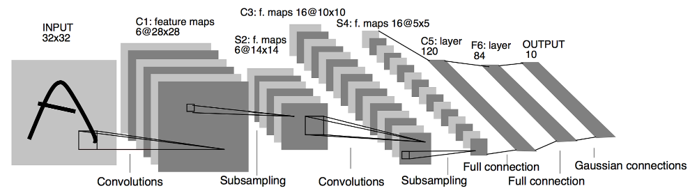
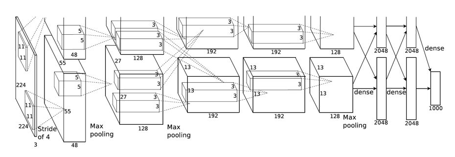
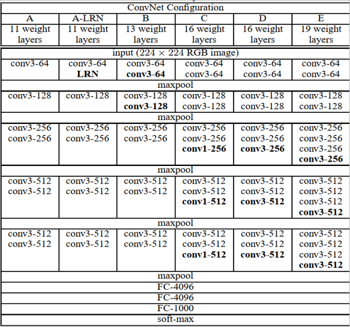
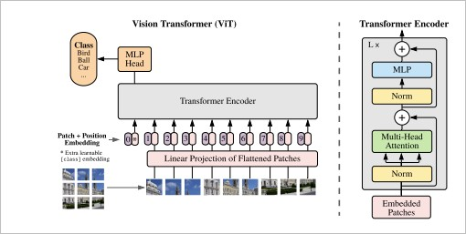
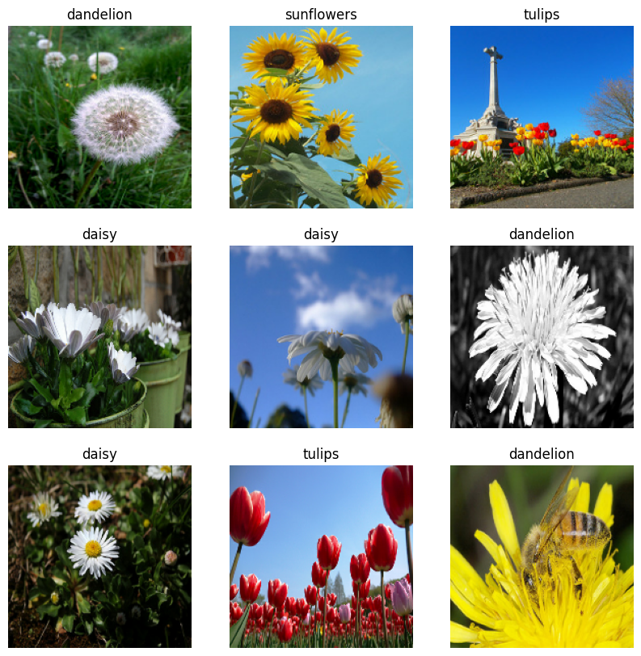
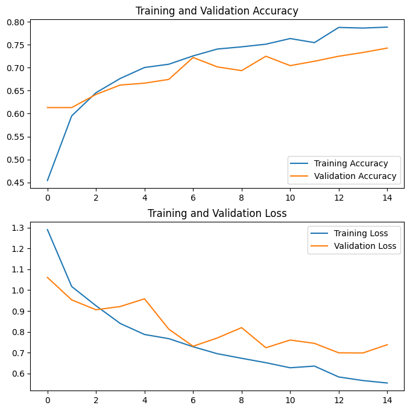
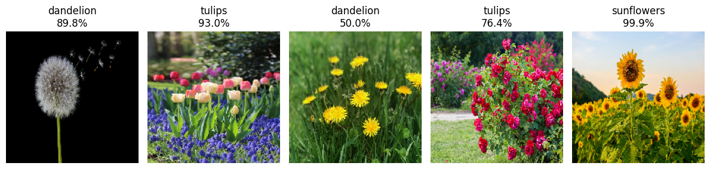

# CNN-ViT-image-classification
A comparative deep learning image classification project using CNN, LeNet-5, AlexNet, VGGNet, and Vision Transformer on the TensorFlow Flowers dataset.
# Flower Image Classification using Deep Learning Architectures

This project presents a comparative deep learning study for image classification using the **TensorFlow Flowers dataset**. The dataset contains flower images from five categories: **daisy, dandelion, roses, sunflowers, and tulips**.

The objective of this project is to design, train, evaluate, and compare multiple deep learning architectures for flower image classification, including **LeNet-5, AlexNet, VGGNet, and Vision Transformer (ViT)**.

## Project Overview

Image classification is one of the most important applications of deep learning and computer vision. In this project, several convolutional neural network architectures and a transformer-based model are implemented to classify flower images into five classes.

The project includes:

* Dataset loading and preprocessing
* Image visualization
* Training and validation split
* Data normalization
* Data augmentation
* Deep learning model development
* Model training and evaluation
* Model evaluation
* Accuracy and loss visualization
* Model comparison across architectures
* Prediction on new images

## Dataset

This project uses the **TensorFlow Flowers dataset**, which contains approximately 3,700 flower images across five classes:

1. Daisy
2. Dandelion
3. Roses
4. Sunflowers
5. Tulips

The dataset is downloaded automatically using TensorFlow utilities.

## Deep Learning Architectures

The following models are implemented and compared:

### 1. LeNet-5

LeNet-5 is one of the earliest convolutional neural network architectures. It is simple and useful for understanding the basic structure of CNN-based image classification.


### 2. AlexNet

AlexNet is a deeper CNN architecture that helped popularize deep learning for large-scale image classification. It uses multiple convolutional layers, pooling layers, and fully connected layers.


### 3. VGGNet

VGGNet uses small convolutional filters and deeper network architecture. It is widely used as a baseline model in computer vision tasks.



### 4. Vision Transformer, ViT

Vision Transformer applies transformer-based architecture to image classification. It divides images into patches and uses self-attention to learn relationships between image regions.


## Project Workflow

The general workflow of this project is:

```text
Dataset Download
        ↓
Image Preprocessing
        ↓
Train/Validation Split
        ↓
Data Augmentation
        ↓
Model Training
        ↓
Model Evaluation
        ↓
Performance Comparison
        ↓
Prediction on New Images
```

## Requirements

Install the required Python packages using:

```bash
pip install -r requirements.txt
```

## How to Run

Clone the repository:

```bash
git clone https://github.com/your-username/flower-image-classification-deep-learning.git
cd flower-image-classification-deep-learning
```

Install dependencies:

```bash
pip install -r requirements.txt
```

Run the notebooks in order:

| Notebook | Description |
|---|---|
| [01_CNN_model.ipynb](notebooks/01_CNN_model.ipynb) | CNN model from scratch for image classification |
| [02_LeNET_model.ipynb](notebooks/02_LeNET_model.ipynb) | LeNet-5 architecture implementation |
| [03_AlexNET_model.ipynb](notebooks/03_AlexNET_model.ipynb) | AlexNet architecture implementation |
| [04_VGGNET_model.ipynb](notebooks/04_VGGNET_model.ipynb) | VGGNet architecture implementation |
| [05_ViT_model.ipynb](notebooks/05_ViT_model.ipynb) | Vision Transformer implementation |

## Results

The models are evaluated using:

* Training accuracy
* Validation accuracy
* Training loss
* Validation loss
* Confusion matrix
* Precision
* Recall
* F1-score

## Screenshots

### Sample Images

### Training Curves

### Prediction on new images


## Future Improvements
I developed these deep learning architectures by studying and following the concepts presented in relevant published research articles, including [LeNet-5](http://yann.lecun.com/exdb/publis/pdf/lecun-01a.pdf), [AlexNet](https://proceedings.neurips.cc/paper/4824-imagenet-classification-with-deep-convolutional-neural-networks.pdf), [VGGNet](https://arxiv.org/abs/1409.1556), and [Vision Transformer](https://arxiv.org/abs/2010.11929). While some implementations may be adapted from deeper investigation, the main goal of this project was to understand the original model architectures and recreate them for the selected image classification dataset.

Future work may include:

* Hyperparameter tuning
* Transfer learning using pretrained models
* Testing on larger image datasets
* Adding Grad-CAM or attention visualization
* Deploying the model using Streamlit or Flask
* Creating a web-based flower classification application

## Developer

**Md. Saifur Rahman**

## Contact

Email: [iamsaif07@gmail.com](mailto:iamsaif07@gmail.com)
